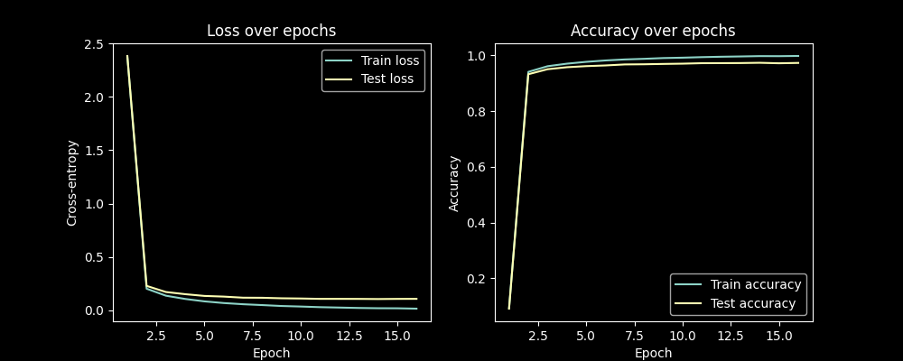

# SimpleNeuralNetwork

Simple Neural Network class that allows the creation of simple MLP networks.

Handles forward pass and backpropagation given output gradient, with each layer individually handling computing its own gradient relative to its derivative.

Example training of simple network using relu activation and 784 x 256 x 128 x 10 architecture loss and accuracy.

Running Testing.py will create and train a network on the MNIST digit database.